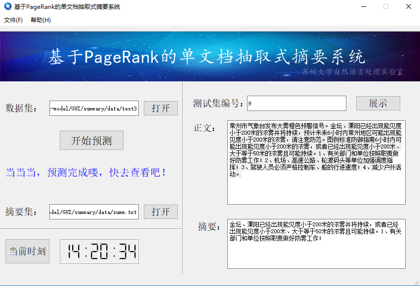
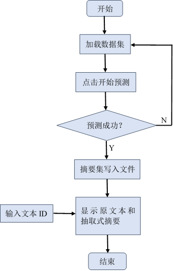

# SUMMARY
a single document summarization based on pagerank algorithm

# 软件简介
该软件是自动文摘系统，实现通过计算机自动地从原始文献中提取出可以全面准确概括原文本核心内容的短文本，从而使得人们在庞大的互联网上高效的利用信息。本系统采用基于图模型的单文档抽取式摘要方法，该方法将文章中每个句子作为图中的节点，利用句子之间内容相似性构建图中节点之间的边。构建好文章图后，利用PageRank算法来迭代计算图中节点的权值，按照权值大小作为句子重要性的评分依据来对文摘句子进行抽取。
本系统主要有三个功能：
(1)	文件功能：主要用于文件数据的读取和显示；
(2)	数据功能：主要是通过PageRank算法，对数据进行处理，抽取摘要并写入文件；
(3)	附加功能：实时展示系统的时间；

* 该系统的运行界面如图1所示：
  
 
  图1 主界面

* 该系统的设计流程图如图2所示：

  

  图2 设计流程图
